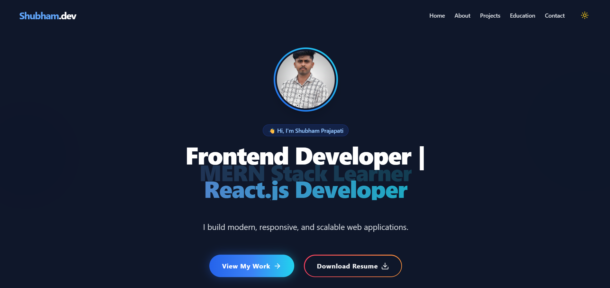
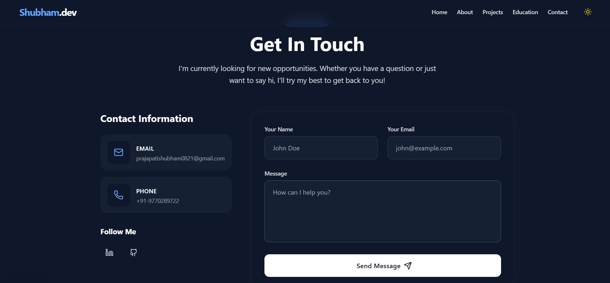

# Shubham Prajapati - Developer Portfolio

A modern, highly responsive, and beautifully animated personal portfolio website built with React and Tailwind CSS. It highlights my skills, featured projects, education, and provides a fully functional contact form.

## 🚀 Features

- **Modern & Premium UI**: Clean design with dynamic glassmorphism, hover glows, and gradient buttons.
- **Dark/Light Mode**: Fully functional theme toggler that remembers user preference.
- **Smooth Animations**: Powered by *Framer Motion*. Features a looping typewriter effect, spring hover states, and smooth scroll-to-view reveals.
- **Fully Responsive**: Mobile-first design that looks crisp on phones, tablets, and modern desktop monitors.
- **Working Contact Form**: Integrated with [Web3Forms](https://web3forms.com/) for direct-to-email messaging without a custom backend.
- **Downloadable Resume**: One-click easy access to my professional resume.

## 📸 Screenshots

### Hero Section


### Education & Certifications


### Contact Section


## 🛠️ Tech Stack

- **Frontend Framework**: React.js
- **Styling**: Tailwind CSS
- **Animations**: Framer Motion
- **Icons**: Lucide React
- **Build Tool**: Vite

## 💻 Getting Started

### Prerequisites
Make sure you have [Node.js](https://nodejs.org/) installed on your machine.

### Installation

1. Clone the repository:
   ```bash
   git clone https://github.com/Shubham0821/Portfolio-website-.git
   ```
2. Navigate into the project directory:
   ```bash
   cd Portfolio-website-
   ```
3. Install the dependencies:
   ```bash
   npm install
   ```
4. Start the development server:
   ```bash
   npm run dev
   ```
   *Your app will be available at `http://localhost:5173/` by default.*

## 📬 Contact Form Setup
The contact form in this portfolio uses Web3Forms. If you fork this project and want to receive emails to your own address:
1. Get an access key from [Web3Forms](https://web3forms.com/).
2. Open `src/components/Contact.jsx`.
3. Replace the `access_key` value in the `formData` with your new key.

## 📄 License
This project is open-source and available under the [MIT License](LICENSE).

---
*Built with ❤️ by Shubham Prajapati*
